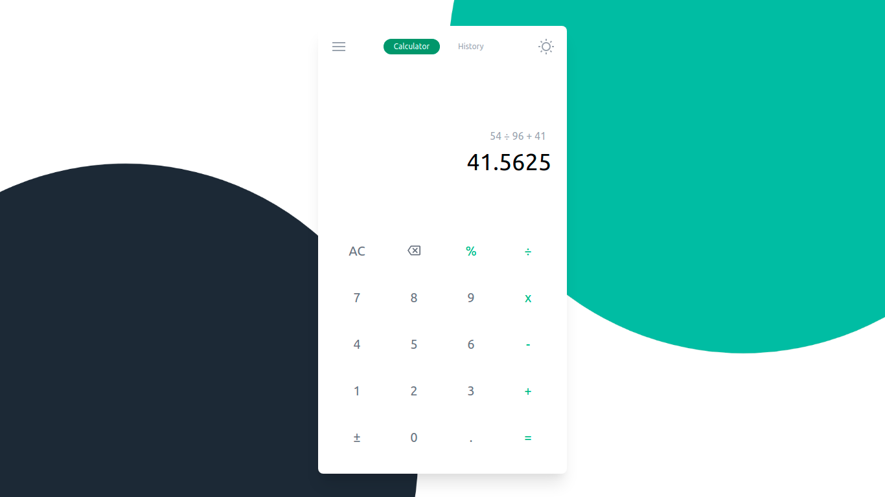
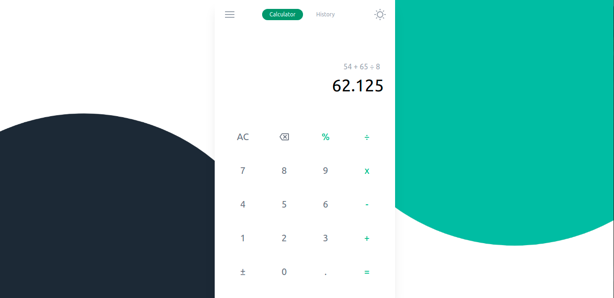

This is a [Next.js](https://nextjs.org/) project bootstrapped with [`create-next-app`](https://github.com/vercel/next.js/tree/canary/packages/create-next-app).

## Getting Started

Run the development server:

```bash
npm run dev
# or
yarn dev
```

Open [http://localhost:3000](http://localhost:3000) with your browser to see the result.

<br />
<h1>Calculator react app that develped via:</h1>
<ul>
    <li style="font-size: 140%;">Nextjs</li>
    <li style="font-size: 140%;">Redux / Redux toolkit</li>
    <li style="font-size: 140%;">Tailwind css</li>
    <li style="font-size: 140%;">Docker / Docker compose</li>
</ul>

<br />
<div style="display: flex; justify-content: center;">
    
</div>
<br />
<br />

## Going to production

Run the production server:

```bash
docker-compose up
```

Open [http://localhost:5060](http://localhost:5060) with your browser to see the result.

<br />
<div style="display: flex; justify-content: center;">
    
</div>
<br />
<br />

<div style="color: gray;">- ui/ux idea from social media <a href="https://devdojo.com/suhailkakar/10-projects-you-can-do-to-become-a-frontend-master" style="text-direction: none">devdojo.com</a></div>
<div style="color: gray;">- MIT LICENSE</div>
